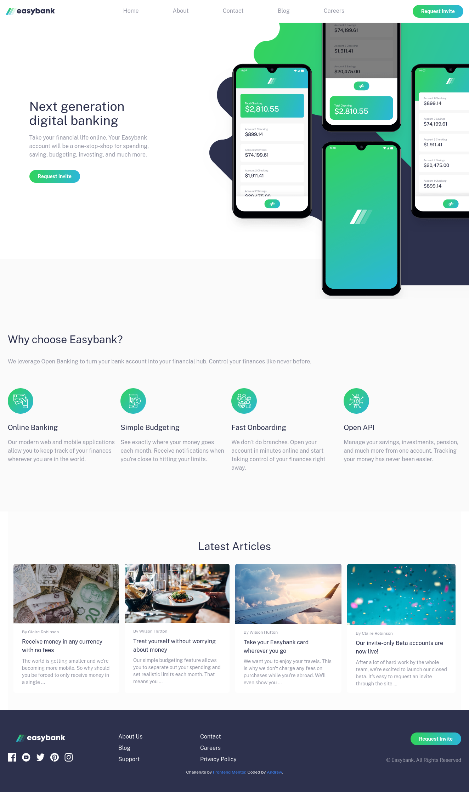

# Frontend Mentor - Easybank landing page solution

This is a solution to the [Easybank landing page challenge on Frontend Mentor](https://www.frontendmentor.io/challenges/easybank-landing-page-WaUhkoDN). Frontend Mentor challenges help you improve your coding skills by building realistic projects.

## Table of contents

- [Overview](#overview)
  - [The challenge](#the-challenge)
  - [Screenshot](#screenshot)
  - [Links](#links)
- [My process](#my-process)
  - [Built with](#built-with)
  - [Useful resources](#useful-resources)
- [Author](#author)
- [Acknowledgments](#acknowledgments)

## Overview

### The challenge

Users should be able to:

- View the optimal layout for the site depending on their device's screen size
- See hover states for all interactive elements on the page

### Screenshot

### Links

- Solution URL: [Add solution URL here](https://your-solution-url.com)
- Live Site URL: [whoamihealay.github.io/easybank-banding-page/](https://whoamihealay.github.io/easybank-banding-page/)

## My process

### Built with

- Semantic HTML5 markup
- Mobile-first workflow
- Vanilla Javascript
- [TailwindCSS](https://tailwindcss.com/) - For styles

### Useful resources

- [TailwindCSS Docs](https://tailwindcss.com/docs/installation)
- [Fireship.io](https://www.youtube.com/c/Fireship) - Awesome Youtube channel. Fireship.io has a "Concept/framework in 100sec" playlist to quickly learn the very basics of a Programming language, framework, or concept. There are also longer videos for more in-depth frontend mini-projects.
- [Kevin Powell](https://www.youtube.com/kepowob) - Discovered on FrontendMentor with the partnership on this challenge and where my CSS game step up to all new level.
- [Google](google.com) - Last but not least, the ultimate bug solver!

## Author

- Website - [whoamihealay](https://whoamihealay.com/)
- Frontend Mentor - [@whoamihealay](https://www.frontendmentor.io/profile/whoamihealay)
- Linkedin - [@andrewsouthern01](https://www.linkedin.com/in/andrewsouthern01/)

## Acknowledgments

A huge thank you to my wife Andrea for her unconditional support and love. To my parents the MVP's of my upbringing!
